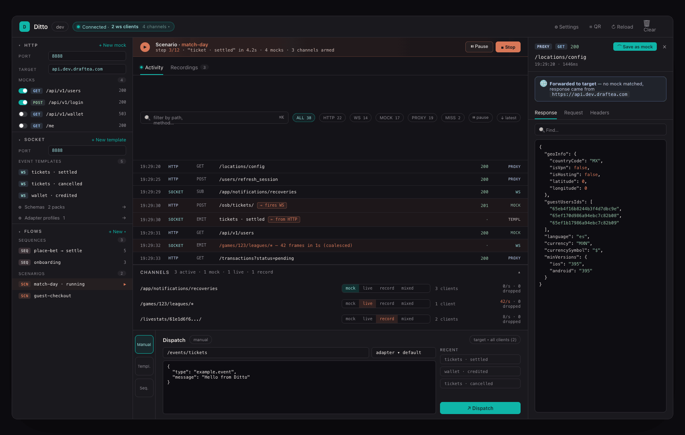

# Ditto · UI guidelines

> Companion to [`docs/UI_RESTRUCTURE_PLAN.md`](UI_RESTRUCTURE_PLAN.md). The plan tells you *how we get to the new layout*. This doc tells you *how to add or change features without breaking it once we're there.*
>
> Visual reference: [`docs/wireframes/option-2-detail-v2.html`](wireframes/option-2-detail-v2.html) (open in a browser) · [`docs/wireframes/option-2-detail-v2.png`](wireframes/option-2-detail-v2.png).
>
> Original Claude Design source for the wireframe: <https://claude.ai/design/p/019e050b-fa8e-7230-bf55-5d3653b4d84f?file=wireframes.html>.



---

## Operating principles

1. **One workspace, three roles.** Left = configure. Center = what is happening right now. Right = inspect / record. Every new piece of UI must answer: *which role does it fill?* If the answer is "two of them", split it.
2. **Transport-agnostic vocabulary.** No top-level "HTTP" vs "WebSocket" tabs. The user's mental model is *what's the app doing right now*, not *which protocol carries it*. HTTP and WS appear interleaved in Activity; per-transport config lives in its sidebar group.
3. **Configuration vs runtime state.** A list of mocks is configuration → sidebar. A list of *currently active channels with their modes* is runtime state → center column. Same data shape can be different things; pick by what the user is doing.
4. **Day-to-day vs power-user config.** Day-to-day artifacts (mocks, templates, sequences, scenarios) live in the sidebar where they're cheap to glance at. Power-user config (schemas, adapter profiles, workspace import/export) lives behind ⚙ Settings — out of the main flow but one click away.
5. **Forward-compatibility is a feature.** Every region listed below has a designated home for what's coming on the roadmap. Slots that don't have content yet render `null`; they are not deleted because the next milestone will fill them.

---

## Region map

The new layout has six regions. When you build a feature, decide which region it belongs to **before** you start writing components.

```
┌─────────────────────────────────────────────────────────────────────────────┐
│ [1] TOPBAR                                                                  │
├──────────┬──────────────────────────────────────────────────────┬───────────┤
│          │ [3] Active scenario banner (slot, M7)                 │           │
│  [2]     ├──────────────────────────────────────────────────────┤    [6]    │
│ SIDEBAR  │ [4] Activity / Recordings                             │ INSPECTOR │
│          │ ┌──────────────────────────────────────────────────┐  │ /         │
│  HTTP    │ │ live log (HTTP+WS) · filter chips · ⌘K           │  │ RECORDER  │
│  Socket  │ ├──────────────────────────────────────────────────┤  │           │
│  Flows   │ │ [5a] Channels strip                              │  │           │
│          │ ├──────────────────────────────────────────────────┤  │           │
│          │ │ [5b] Dispatch dock                               │  │           │
└──────────┴──────────────────────────────────────────────────────┴───────────┘
```

| # | Region | Purpose | Lives in | Owns |
| -- | --- | --- | --- | --- |
| **1** | Topbar | Identity + global controls + connection state | `Header.tsx` | logo, env pill, Connection pill (popover lists ws clients with `dropped`), ⚙ Settings, QR, Reload, Clear |
| **2** | Sidebar | All artifacts the user can configure | `Sidebar.tsx` | three collapsible groups: **HTTP**, **Socket**, **Flows** |
| **3** | Active scenario banner | Runtime state of the currently-running scenario | (slot in `AppShell`) | renders `null` while `useScenarioStore.activeScenarioId === null`; populated by v1.6 |
| **4** | Activity / Recordings | What is happening right now (Activity) and the historical documents that describe past sessions (Recordings) | `LogPanel.tsx` + `RecordingsView.tsx` | unified live log, filter chips (`HTTP / WS / MOCK / PROXY / MISS`), `⌘K`, coalesced bursts, recording browser/detail |
| **5a** | Channels strip | Per-channel runtime state (mode, subs, rate, dropped) | new component (extracted from `SocketPanel.tsx:257-298`) | mode selector, dropped counter, summary chip when many channels |
| **5b** | Dispatch dock | The "send something now" surface | new component (extracted from `SocketPanel.tsx` + `EventTemplatesPanel.tsx` + `SequencePlayerView.tsx`) | mode rail (Manual / Templ / Seq), channel picker, payload, recent, target picker |
| **6** | Inspector / Recorder | Drilldown for a selected log entry + Save-as-mock | `Drawer.tsx` | response/request/headers tabs, JSON search, Save-as-mock |

### Sidebar groups (region 2 in detail)

```
─── HTTP ─────────────── (transport)
  Port · Target · Mocks (list with toggles)

─── SOCKET ────────────── (transport)
  Port · Event Templates (list)
  ⚙ Schemas             → opens Settings
  ⚙ Adapter profiles    → opens Settings

─── FLOWS ────────────── (composition across transports)
  Sequences (list)
  Scenarios  (slot · v1.6)
```

Why three groups:

- **HTTP** and **Socket** are the two transports. Each owns its day-to-day artifacts (mocks for HTTP, event templates for Socket) and quick links to its deeper config (schemas / adapter profiles, which open the Settings modal for editing).
- **Flows** is everything that *composes* across transports. Sequences (timeline of WS events) live here today; Scenarios (atomic activation of HTTP mocks + channel modes + sequences + triggers) join in v1.6 — they are different abstraction levels and **coexist**, not a rename or a superset.

---

## Where new features go (decision flow)

Before adding a feature, walk this tree:

1. **Is the feature configuration or runtime?**
   - *Configuration* (lists, editors, on/off toggles) → **Sidebar**.
   - *Runtime state* (something happening *now* you can pause/inspect) → **Center**.
   - *Per-entry drilldown* of something already in the log → **Inspector**.

2. **If sidebar:** is it a transport artifact (HTTP-specific or WS-specific) or a flow that composes both?
   - HTTP-only → **Sidebar → HTTP**.
   - WS-only → **Sidebar → Socket**.
   - Composes both → **Sidebar → Flows**.
   - Power-user / one-time setup (schemas, adapter profiles, import/export) → **Settings modal**, with a `⚙` deep-link in the appropriate sidebar group.

3. **If center:** is it the full live picture, the per-channel runtime, or something to send?
   - Live picture → **Activity / Recordings** panel (filter chips, log row variants).
   - Per-channel runtime (mode, rate, drops) → **Channels strip**.
   - Composing+sending an event/sequence/scenario → **Dispatch dock**.

4. **If global state of an active flow** (a running scenario, a recording in progress with global controls) → **banner above Activity** (regions 3 — only one banner at a time, summary + primary action).

5. **Is the feature visible in two roles at once** (e.g., a list of recordings *and* a live recording-in-progress indicator)? Split it: configuration into the sidebar (or Recordings list), runtime into the banner / Channels strip / Activity.

If after this tree you can't decide, the feature might not actually be ready for UI yet — talk to the design owner.

---

## Forward-compat slots (where future roadmap features land)

These are reserved by **UI-M6** as empty slots so the corresponding roadmap PR is small. Do not delete or repurpose them.

| Slot | Roadmap milestone | What goes there |
| --- | --- | --- |
| Active scenario banner above Activity | **v1.6 / M7 Scenarios** | summary line · current step · `Pause` / `Stop` · count of resources owned |
| Sidebar Flows → Scenarios sub-section | **v1.6 / M7 Scenarios** | scenario list, `+ New scenario`, running indicator dot |
| `linkedEventId` prop on Activity row | **v1.6 / M7 HTTP→Socket triggers** | bidirectional arrow `→ fires WS` / `← from POST /…`, click to scroll-and-highlight |
| Recordings tab in Activity panel | **M5 (today, capture only) → M6 (replay/edit)** | timeline view, per-event actions (edit / delete / duplicate / send-a-copy / export-to-template), trim/splice/filter, convert-to-sequence |
| Settings → Adapter profiles section | **M9 Adapter profile UI** | form-driven editor, live preview, validation, dry-run dispatch — replaces today's read-only listing |
| Settings → Workspace section | **v1.9 / M8 `.dittopack`** | Import bundle, Export current setup, conflict resolution UI |

When you ship one of these, **fill the existing slot** rather than adding a new region. Budget: a fully-rendered banner should not require structural changes to `AppShell`.

---

## Visual conventions

- **Palette:** dark base (`--bg #141318` / `--panel #1a191e` / `--line #2f2c33`), teal accent (`--teal #0fb5a8`), warm warn (`--warn #d97757`) reserved for active scenarios and live mode. Do not introduce new accent colors per feature.
- **Typography:** Inter for UI, JetBrains Mono for paths/log/payloads. Status badges and method tags use the mono font.
- **Badges:** `GET` (blue), `POST` (green), `WS` (teal), `SEQ` (magenta), `SCN` (warn). Adding a new artifact type? Pick from the existing set first; create a new badge color only after design review.
- **Mode selectors:** segmented control with mock / live / record / mixed. `live` and `mixed` are disabled (greyed) when no `--live-target` is configured — surface the reason via tooltip, never via toast.
- **Coalescing:** burst log rows render as a single warn-tinted row (`"42 frames in 1s (coalesced)"`). The same row component that renders single events renders coalesced ones — do not introduce a separate component.
- **Empty states:** every region has one. Sidebar groups show a single line + `+ New`; Activity shows "waiting for requests…"; Channels strip is hidden when no channel is active.

---

## Things to push back on

You'll probably be asked to do these. Don't.

- **A new top-level tab.** Tabs were the previous mental model and they're explicitly gone. The new feature goes in the sidebar, the center, or Settings.
- **A floating window for X.** Drawers and modals exist for the inspector and Settings. New floating surfaces fragment the workspace.
- **A second log/timeline view.** There's one Activity log. If a feature needs its own timeline (recording replay), it goes inside the Recordings tab, not parallel to Activity.
- **Per-feature theme tokens.** Reuse the palette. New colors come through design review, not through PRs.
- **A "scenarios overview" page that duplicates the sidebar list.** Selection drives a detail panel; we don't replicate lists across regions.

---

## Cross-references

- [`docs/UI_RESTRUCTURE_PLAN.md`](UI_RESTRUCTURE_PLAN.md) — the milestone plan to *get* to this layout.
- [`docs/WEBSOCKET_ARCHITECTURE.md`](WEBSOCKET_ARCHITECTURE.md) — backend architecture and milestone breakdown for M5–M9.
- [`ROADMAP.md`](../ROADMAP.md) — product roadmap; UI restructure is **v1.5.x** (between v1.4 and v1.5).
- Wireframe HTML: [`docs/wireframes/option-2-detail-v2.html`](wireframes/option-2-detail-v2.html).
- Wireframe PNG: [`docs/wireframes/option-2-detail-v2.png`](wireframes/option-2-detail-v2.png).
- Claude Design source: <https://claude.ai/design/p/019e050b-fa8e-7230-bf55-5d3653b4d84f?file=wireframes.html>.
